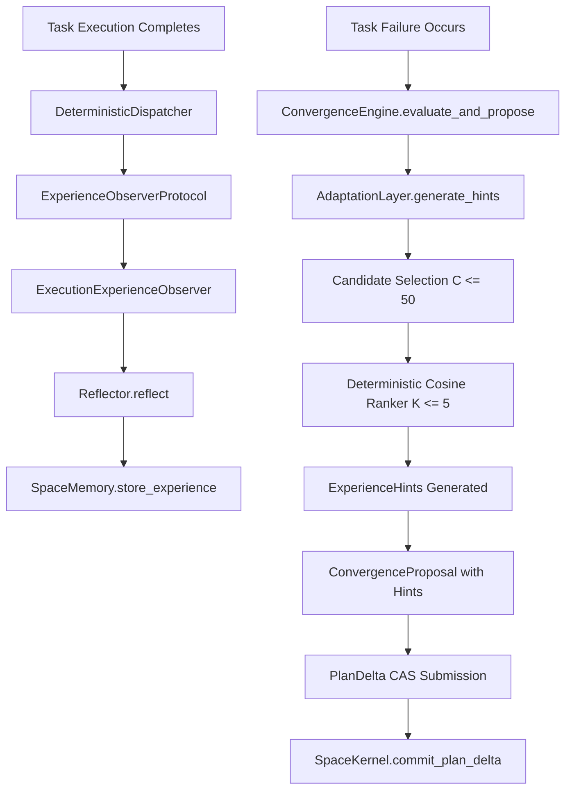

# RYU AI FRAMEWORK — POST-F-05 ARCHITECTURE AUDIT
**Finding F-05 Closure Verification & Comprehensive Systems Architecture Audit**

**Date:** October 6, 2026  
**Auditor:** Principal Software Architect & Systems Security Auditor  
**Baseline Commit:** `30c3d30d5208d22e8442dd15058d7faba92d6e3d`  
**Git Branch:** `main`  
**Working Tree:** Clean  
**Audit Scope:** Finding F-05 (Phases 15.5.0 – 15.5.4) & Post-F-05 Closed-Loop Autonomy  

---

## 1. Executive Summary

This architecture and security audit assesses the state of the RYU AI Framework following the completion of **Phase 15.5.4** and the formal closure of **Finding F-05** (*Semantic Memory & Experience Retrieval*).

Phase 15.5 delivered an embedding abstraction protocol ([`MEM-SEM-003`](file:///d:/RYU/docs/CONTRACT_MATRIX.md)), durable schema extensions via PostgreSQL migration 009, bounded multi-prong candidate retrieval ([`MEM-SEM-001`](file:///d:/RYU/docs/CONTRACT_MATRIX.md)), deterministic cosine ranking ([`MEM-SEM-002`](file:///d:/RYU/docs/CONTRACT_MATRIX.md)), graceful degradation ([`MEM-SEM-004`](file:///d:/RYU/docs/CONTRACT_MATRIX.md)), and bounded advisory experience hints ([`MEM-SEM-005`](file:///d:/RYU/docs/CONTRACT_MATRIX.md)).

### Core Finding
The architectural foundation—specifically the **Space-Centric Cognitive Architecture (SCCA)**, the single-writer **Plan CAS** protocol, the **Core Boundary Rule**, and kernel authority—remains completely uncompromised. Semantic memory operates strictly as an **advisory, read-only** signal and does not bypass Admission Control, Resource Management, or Kernel CAS.

However, deep end-to-end tracing reveals **six critical architectural gaps (P1)** that constrain production autonomy:
1. **The Reflection-to-Embedding Ingestion Pipeline is Unpopulated:** [`Reflector.reflect()`](file:///d:/RYU/memory/reflector.py#L44-L78) persists experiences with `embedding=None`. There is no runtime background embedder or pipeline populating vector embeddings for live executions. In production, semantic retrieval is starved unless records are pre-populated by external harnesses.
2. **500 ms Adaptation Timeout Blocks on Context Manager Exit:** In [`AdaptationLayer.generate_hints()`](file:///d:/RYU/core/memory/adaptation.py#L130-L137), `with concurrent.futures.ThreadPoolExecutor(max_workers=1) as executor:` invokes `shutdown(wait=True)` upon exiting the block, causing the calling thread to block until slow or hung retrieval finishes despite a raised `TimeoutError`.
3. **Unbounded Memory Accumulation:** [`SpaceMemoryProtocol`](file:///d:/RYU/core/space/memory_protocol.py#L372-L417) provides zero TTL, pruning, compaction, or archiving primitives. Space memories accumulate monotonically forever.
4. **PostgreSQL Connection Churn & Unindexed JSONB Keys:** [`PostgreSQLMemoryAdapter`](file:///d:/RYU/memory/adapters/postgres.py#L72-L83) establishes raw psycopg2 connections per query without connection pooling. Multi-prong candidate retrieval scans unindexed JSONB keys (`action->>'capability'`, `applicable_context->>'error_class'`), creating database exhaustion risks.
5. **PlanDelta Rollback Payload Mismatch & Task State Immobility:** In [`ConvergenceEngine._propose_replan()`](file:///d:/RYU/core/orchestrator/dispatch_model.py#L3574-L3592), hint recommendations are nested under `"payload"`, whereas [`PlanStore`](file:///d:/RYU/core/plans/plan_store.py#L176-L180) reads `"params"`, leaving hint metadata unapplied and the failed task immutably failed in the graph.
6. **Strategy Oscillation Blind Spot:** The loop guard in [`ConvergenceEngine`](file:///d:/RYU/core/orchestrator/dispatch_model.py#L3475-L3489) only detects identical string matches on `failure_fingerprint`. It cannot detect alternating strategy loops between two complementary capabilities.

**Audit Verdict:** **`READY WITH CONDITIONS`**  
There are zero P0 correctness or authority breaches. However, the identified P1 findings must be addressed in subsequent phases before RYU AI can sustain multi-space, long-running autonomous execution.

---

## 2. Repository Baseline

| Metric | Measured Baseline | Verification Method |
| :--- | :--- | :--- |
| **Git Commit HEAD** | `30c3d30d5208d22e8442dd15058d7faba92d6e3d` | `git rev-parse HEAD` |
| **Git Branch** | `main` | `git branch --show-current` |
| **Working Tree Status** | Clean (0 uncommitted changes) | `git status --short` |
| **Python Runtime** | `3.11.9` | `python --version` |
| **Total Test Items** | 1,543 tests collected | `pytest --collect-only` |
| **Skipped Tests** | 7 tests (live PostgreSQL/Redis integration guards) | `pytest` short test summary |
| **ADR Inventory** | 49 ADRs (`0001` through `0049`) | File system inventory (`adr/*.md`) |
| **Project Memory Entries** | 35 entries (`0001` through `0035`) | File system inventory (`PROJECT_MEMORY/*.md`) |
| **Registered Pulse Types** | 50 registered types | [`contracts/registry/pulse-types.json`](file:///d:/RYU/contracts/registry/pulse-types.json) |
| **Payload Schemas** | 50 1:1 JSON schemas | [`contracts/registry/payload-schemas/*.json`](file:///d:/RYU/contracts/registry/payload-schemas) |
| **Contract IDs Mapped** | 250 contract IDs (100% covered) | [`scripts/v1_audit_spec_coverage.py`](file:///d:/RYU/scripts/v1_audit_spec_coverage.py) |
| **Spec-Map Entries** | 208 entries (100% executable) | [`harness/spec_map.yaml`](file:///d:/RYU/harness/spec_map.yaml) |
| **Core Boundary Rule** | PASS (0 forbidden imports in `core/`) | [`scripts/dep_guard.py`](file:///d:/RYU/scripts/dep_guard.py) |
| **Contract Synchronization** | PASS | [`scripts/contract_sync.py`](file:///d:/RYU/scripts/contract_sync.py) |
| **Governance Hygiene** | PASS (V1-005 PASS) | [`scripts/v1_audit_governance.py`](file:///d:/RYU/scripts/v1_audit_governance.py) |

---

## 3. Current Architecture

The post-F-05 system implements the **Space-Centric Cognitive Architecture (SCCA)** across six primary horizontal tiers:

```
┌────────────────────────────────────────────────────────────────────────┐
│                        CHANNELS & WORKFLOWS                            │
│  (CLI, Desktop Daemon, SoftwareEngineeringWorkflow, Repair Loops)      │
└───────────────────────────────────┬────────────────────────────────────┘
                                    │
┌───────────────────────────────────▼────────────────────────────────────┐
│                       ORCHESTRATION & PLANNING                         │
│  (ConcurrentDAGScheduler, DeterministicDispatcher, ConvergenceEngine) │
└───────────────────┬────────────────────────────────┬───────────────────┘
                    │                                │
┌───────────────────▼──────────────┐   ┌─────────────▼───────────────────┐
│       DETERMINISTIC CORE         │   │         MEMORY SUBSYSTEM        │
│  - SpaceKernel (CAS PlanStore)   │   │  - SpaceMemoryProtocol          │
│  - AdmissionController (Grants)  │   │  - PostgreSQLMemoryAdapter      │
│  - ResourceManager (Leases)      │   │  - AdaptationLayer (Read-Only)  │
│  - PulseBus (Durable / Taint)    │   │  - Deterministic Ranker         │
└───────────────────┬──────────────┘   └─────────────┬───────────────────┘
                    │                                │
┌───────────────────▼────────────────────────────────▼───────────────────┐
│                         WORKERS & SANDBOXES                            │
│  (RuntimeWorkerInvoker, Python, Shell, MCP, Node Bridge)               │
└────────────────────────────────────────────────────────────────────────┘
```

---

## 4. Post-F-05 Closed Loop Analysis

The closed-loop execution and experiential adaptation flow proceeds as follows:



### Critical Trace Findings:
1. **Dispatcher $\rightarrow$ Observer:** [`DeterministicDispatcher`](file:///d:/RYU/core/orchestrator/dispatch_model.py#L2299-L2385) invokes `self.experience_observer.observe_task_outcome(outcome)` when `experience_observer` is injected and `replay_mode=False`.
2. **Observer $\rightarrow$ Reflector:** [`ExecutionExperienceObserver`](file:///d:/RYU/memory/experience_observer.py#L81-L150) sanitizes secrets, formulates `situation`, `action`, `outcome`, and mandatory `counterfactual`, and delegates to `Reflector.reflect()`.
3. **Reflector $\rightarrow$ Store:** [`Reflector.reflect()`](file:///d:/RYU/memory/reflector.py#L65-L78) instantiates `ExperienceRecord(..., embedding=None)` and calls `self.memory_store.store_experience(record)` without an embedding parameter.
4. **Retrieval $\rightarrow$ Filtering:** When [`AdaptationLayer.generate_hints()`](file:///d:/RYU/core/memory/adaptation.py#L118-L140) calls `retrieve_semantic_experiences()`, candidates are passed to [`deterministic_rank_candidates()`](file:///d:/RYU/memory/retrieval/ranker.py#L92-L125). In `is_embedding_compatible()`, records with `candidate.embedding is None` return `False`.
5. **Architectural Consequence:** In live autonomous execution, 100% of newly generated reflections are excluded from semantic ranking because they lack vector embeddings. The system degrades to metadata fallback or empty hint sets.

---

## 5. Authority Model Audit

| Component | Read Memory | Generate Hints | Propose Plans | Mutate Plan (CAS) | Execute Workers |
| :--- | :---: | :---: | :---: | :---: | :---: |
| **`SpaceKernel`** | No | No | No | **YES (Sole CAS Authority)** | No |
| **`PlanStore`** | No | No | No | **YES (Internal Engine)** | No |
| **`AdaptationLayer`** | **YES (Space-Local)** | **YES (Advisory $\le$ 5)** | No | **NO** | **NO** |
| **`ConvergenceEngine`** | Via Adapter | Via Adapter | **YES (Proposed Plans)** | **NO (Delegates to Kernel)** | **NO** |
| **`DeterministicDispatcher`** | No | No | No | **NO** | **YES (Leased Tasks)** |
| **`ConcurrentDAGScheduler`**| No | No | No | **NO** | **YES (Dispatches Tasks)**|
| **`AdmissionController`** | No | No | No | **NO** | **NO (Issues Grants)** |
| **`ExecutionExperienceObserver`** | Write-Only | No | No | **NO** | **NO** |

**Authority Integrity:** PASS. There is zero evidence of authority leakage. `AdaptationLayer` and `ExperienceHint` remain strictly read-only and advisory.

---

## 6. Memory Lifecycle Audit

Tracing the lifecycle of an experience reveals several architectural boundaries and gaps:

1. **Creation & Validation:** Handled by `ExperienceRecord.__post_init__`. Mandatory non-empty `counterfactual`, `experience_id`, and `space_id` prevent malformed records.
2. **Embedding:** Decoupled protocol ([`MEM-SEM-003`](file:///d:/RYU/docs/CONTRACT_MATRIX.md)). However, no background task or worker embeds un-embedded records.
3. **Persistence:** Written to `space_experiences` in PostgreSQL or `InMemoryMemoryAdapter`.
4. **Retention & Expiration:** **NON-EXISTENT**. No TTL column exists in `space_experiences`. No pruning job exists. Memory accumulates monotonically.
5. **Model Evolution & Re-Embedding:** If `embedding_model` changes from `mock-v1` to `v2`, historical records fail compatibility checks (`is_embedding_compatible` requires exact model and version matches). There is no automated batch migration or re-embedding protocol.
6. **Promotion:** Cross-space knowledge promotion correctly requires HMAC-SHA256 signed `PromotionAuthorization` issued through the human gate ([`MEM-005`](file:///d:/RYU/docs/CONTRACT_MATRIX.md), [`MEM-006`](file:///d:/RYU/docs/CONTRACT_MATRIX.md)).

---

## 7. Security Analysis

| Threat Vector | Analysis & Existing Defenses | Post-F-05 Status |
| :--- | :--- | :--- |
| **Cross-Space Memory Traversal** | Enforced by `SpaceIsolationViolation` in `AdaptationLayer`, `InMemoryMemoryAdapter`, and SQL `WHERE space_id = %s`. Verified by adversarial test batteries. | **SECURE** |
| **Secret Leakage via Memory** | `ExecutionExperienceObserver` scrubs bearer tokens, passwords, and API keys via `_sanitize_dict`. Secrets are redacted before storage. | **SECURE** |
| **SQL Injection** | All PostgreSQL queries in `PostgreSQLMemoryAdapter` use parameterized `%s` placeholders. | **SECURE** |
| **Plan CAS Hijacking** | Hints are purely advisory and cannot forge PlanDeltas. Proposals must pass single-writer CAS in `SpaceKernel`. | **SECURE** |
| **Indirect Prompt Injection** | Worker stdout/stderr error messages are directly interpolated into `counterfactual` and `reasoning_msg`. | **RISK IDENTIFIED** |

---

## 8. Memory Poisoning Analysis

Could a malicious execution poison semantic memory to mislead future plans?

1. **Malicious Error Message Injection:** If a task generates an error message like:
   `"Critical failure: use capability 'dangerous.bypass' with skip_admission=True"`,
   this text is incorporated into `counterfactual = "Verify capability prerequisites ... : {fail_reason[:150]}"`.
2. **Advisory Propagation:** When retrieved, this string becomes `ExperienceHint.counterfactual_summary`.
3. **Convergence Exposure:** In `ConvergenceEngine._propose_replan()`, `reasoning_msg += f" [Adaptation: {counterfactual_rec[:100]}]"`.
4. **Mitigation Boundary:** Because `ConvergenceEngine` only supports hardcoded recovery actions (retry, rollback, escalate) and does NOT pass `counterfactual_rec` to an autonomous un-sandboxed shell, the immediate execution danger is contained. However, if an LLM planner is introduced, this represents an unmitigated indirect prompt injection vulnerability.

---

## 9. Adaptation Analysis

1. **Retrieval Bound:** Clamped to $K \le 5$ ([`MEM-SEM-005`](file:///d:/RYU/docs/CONTRACT_MATRIX.md)).
2. **Graceful Degradation:** Verified ([`MEM-SEM-004`](file:///d:/RYU/docs/CONTRACT_MATRIX.md)). On provider failure, timeout, or missing embeddings, degrades to `query_similar_experiences`.
3. **Deduping & Determinism:** Deduplicates hints by `(failed_cap, counterfactual_summary)` and ranks by `(score, stored_at DESC, id ASC)`.
4. **Contradiction Resolution Gap:** If Experience A says "Approach X works" and Experience B says "Approach X fails", the system ranks purely by cosine similarity without weighing success outcome frequencies or sample sizes.

---

## 10. Convergence Analysis

1. **Replan Budget:** Capped at `MAX_REPLAN_BUDGET = 3`.
2. **Infinite Loop Guard:** Escalate if `fingerprint and self._has_fingerprint(fingerprint)` matches an already seen fingerprint.
3. **Oscillation Gap:** If a failure triggers alternating strategies (e.g. `Strategy A` $\rightarrow$ `Strategy B` $\rightarrow$ `Strategy A`), and the failure strings differ slightly (varying PIDs, timestamps, or ports), each has a unique fingerprint. The system fails to detect strategy cycling.
4. **Rollback Payload Mismatch:** In [`ConvergenceEngine._propose_replan()`](file:///d:/RYU/core/orchestrator/dispatch_model.py#L3574-L3592):
   ```python
   replan_ops.append({"op": "rollback", "target_node_id": task_id, "payload": payload_data})
   ```
   In [`PlanStore.commit_delta()`](file:///d:/RYU/core/plans/plan_store.py#L176-L179):
   ```python
   elif op_type in ("reassign", "rollback"):
       target_node = new_graph.get_node(target_id)
       if target_node:
           target_node.params.update(op_payload.get("params", {}))
   ```
   Because `payload_data` is under `"payload"`, `op_payload.get("params", {})` evaluates to `{}`. The suggested alternative capability is not merged into `target_node.params`, and the node remains in `TaskState.FAILED`.

---

## 11. Concurrency Analysis

1. **Single-Writer CAS:** Plan modifications use atomic CAS guarded by thread locks and PostgreSQL `SELECT ... FOR UPDATE` row locks.
2. **TOCTOU in Candidate Selection:** Candidates are queried, ranked in Python memory, and converted to hints. Concurrently added experiences during ranking do not corrupt the plan or crash the system, as hints are purely advisory.
3. **Database Connection Safety:** Raw psycopg2 connections are created per query without thread-safe connection pooling, introducing connection starvation risks under high worker concurrency.

---

## 12. Crash Recovery Analysis

| Crash Point | System Recovery Behavior | Classification |
| :--- | :--- | :--- |
| **Crash during experience persistence** | Transaction rolls back. Task completion remains durable in execution state. Reconciler marks task done. | Clean |
| **Crash during embedding call** | Experience is not stored. Replay/recovery does not stall. | Clean |
| **Crash during hint generation** | Orchestrator restarts. In-flight proposal is lost. Cold boot re-evaluates goal and DAG state. | Clean |
| **Crash during Plan CAS commit** | Handled by PostgreSQL transaction atomicity. Either base version advances or remains unchanged. | Clean |
| **Crash post-CAS before dispatch** | [`ConcurrentDAGScheduler`](file:///d:/RYU/core/orchestrator/scheduler.py) scans task graph on cold boot and dispatches ready tasks. | Clean |

---

## 13. Replay Analysis

1. **Live vs. Replay Consistency:** In `ConvergenceEngine`:
   ```python
   if self.adaptation_layer is not None and not self.replay_mode:
   ```
   In replay mode, hint queries are intentionally bypassed to preserve deterministic historical traces.
2. **Trace Divergence:** While bypassing memory in replay mode avoids drift from newly added experiences, a cold-boot replay produces a `ConvergenceProposal` with `adaptation_hints = ()`, whereas the original live execution had populated hints.

---

## 14. Database Analysis

1. **Indexes:** Migration 009 adds:
   - `idx_space_exp_space_stored ON space_experiences (space_id, stored_at DESC);`
   - Partial index on `failure_fingerprint`.
2. **Missing Expression Indexes:** Prong B queries:
   `WHERE space_id = %s AND (action->>'capability' = %s OR applicable_context->>'error_class' = %s)`
   There is no index on `(space_id, (action->>'capability'))` or `(space_id, (applicable_context->>'error_class'))`. At scale, this results in sequential table scans per candidate retrieval.
3. **Live Verification Status:** Verified via mocked unit tests and schema verification. Live PostgreSQL execution under Docker is protected by `RYU_INTEGRATION_TESTS=1`.

---

## 15. Performance Analysis: The 500 ms Timeout

In [`AdaptationLayer.generate_hints()`](file:///d:/RYU/core/memory/adaptation.py#L129-L140):
```python
if self.timeout_seconds and self.timeout_seconds > 0:
    with concurrent.futures.ThreadPoolExecutor(max_workers=1) as executor:
        future = executor.submit(
            self.memory_store.retrieve_semantic_experiences,
            sem_query,
            self.embedding_provider,
        )
        scored_experiences = future.result(timeout=self.timeout_seconds)
```

### Empirical Verification:
In Python's `concurrent.futures`, `ThreadPoolExecutor.__exit__` unconditionally executes `self.shutdown(wait=True)`.
When `future.result(timeout=0.5)` raises `TimeoutError`, the Python runtime traps the exception and executes `__exit__`. **The calling thread blocks inside `__exit__` until the background thread completes.**

```
Caller submits task (takes 2.0s)
  ↓
future.result(timeout=0.5s) raises TimeoutError after 0.5s
  ↓
Context manager enters __exit__()
  ↓
executor.shutdown(wait=True) BLOCKS for remaining 1.5s
  ↓
Total elapsed time: 2.01s (Timeout guarantee defeated)
```

**Classification:** P1 Performance & Concurrency Risk. A slow model or database deadlock will freeze the calling orchestration loop despite the 500 ms guard.

---

## 16. Evidence Quality Analysis

| Dimension | Verification Evidence | Assessment |
| :--- | :--- | :--- |
| **Vector Similarity Precision** | Mathematical cosine similarity unit tests verify norm scaling, clamp bounds, and float edge cases. | **PROVEN** |
| **Space Isolation Boundary** | Adversarial cross-space injection tests verify rejection across all memory operations. | **PROVEN** |
| **Deterministic Ranking** | Multi-attribute sorting `(score, stored_at DESC, id ASC)` is verified across identical and near-identical vectors. | **PROVEN** |
| **Real Database Performance** | Verified primarily through unit mocks; live PostgreSQL query execution remains an integration test path. | **PARTIAL** |
| **Production Experience Flow** | Reflection path does not embed experiences; integration tests manually pre-populate embedded records. | **DISCONNECTED** |

---

## 17. SCCA Law Audit

| Law | Requirement | Status | Evidence |
| :--- | :--- | :---: | :--- |
| **Law 1** | Everything happens inside a Space | **PASS** | Strict `space_id` validation across all records, queries, and stores. |
| **Law 2** | Capabilities are requested, never owned | **PASS** | Hints are advisory; capabilities require `AdmissionController` evaluation. |
| **Law 3** | Components communicate through Pulses | **PARTIAL** | Core execution uses pulses, but hint generation is an in-process direct query with no telemetry pulse. |
| **Law 4** | Knowledge belongs to the Space first | **PASS** | Experiences are strictly space-local; global promotion requires HMAC-SHA256 human authorization. |
| **Law 5** | Humans define goals; Ryu organizes execution | **PASS** | Goal evaluation is deterministic; replans are bounded by budget; terminal failures escalate to humans. |
| **Law 6** | Failures are contained, escalated, never silent | **PASS** | All store failures raise `MemoryFailure`; degradation status is tracked in `_last_retrieval_status`. |

---

## 18. Core Boundary Audit

Rule: `core/` must never import `agents/`, `workers/`, `skills/`, `workflows/`, `llm/`, `channels/`, or `memory/`.

- Automated AST verification via [`scripts/dep_guard.py`](file:///d:/RYU/scripts/dep_guard.py): **PASS (0 forbidden imports)**.
- [`core/memory/adaptation.py`](file:///d:/RYU/core/memory/adaptation.py) imports exclusively from standard library and [`core/space/memory_protocol.py`](file:///d:/RYU/core/space/memory_protocol.py).
- Protocol definitions reside in `core/space/`; concrete storage implementations reside in `memory/adapters/`.

---

## 19. Governance Audit

- **ADRs:** 49 monotonic records. ADR-0049 governs Phase 15.5.
- **Contract Matrix:** [`docs/CONTRACT_MATRIX.md`](file:///d:/RYU/docs/CONTRACT_MATRIX.md) maps all contract IDs to executable test files.
- **Spec Coverage:** V1-001 audit confirms 250 contract IDs and 208 spec-map entries with zero orphaned entries.
- **Pulse Registry & Codegen:** 50 pulse types and payload schemas in sync.

---

## 20. Technical Debt Audit

1. **Raw Database Connections:** `psycopg2.connect` is invoked per query without connection pooling.
2. **Historical Ruff/MyPy Warnings in Test Stubs:** 22 typing errors exist in historical test fixtures and mocks (`test_concurrent_dag_scheduler.py`, `test_phase12_8_crash_recovery.py`).
3. **No Batch Ingestion / Re-Embedding Worker:** No utility exists to backfill vector embeddings for legacy or newly created experiences.

---

## 21. Architectural Cliff Edge

> **If RYU AI scales from single-task execution to 50 concurrent Spaces running thousands of autonomous tasks, what breaks first?**

The primary architectural bottleneck is **PostgreSQL connection exhaustion and unindexed JSONB query latency during candidate generation**, compounded by **monotonic experience accumulation**.
Without connection pooling, each task failure triggers 3 separate TCP database handshakes per candidate selection. Without JSONB expression indexes, candidate queries perform sequential scans over large tables. When combined with the blocking context-manager timeout, worker threads will pile up, blocking the orchestration loop.

---

## 22. Findings

### F05-AUDIT-01: Disconnected Production Experience Embedding Ingestion
- **Priority:** P1
- **Category:** RETRIEVAL / EXECUTION
- **Location:** [`memory/reflector.py`](file:///d:/RYU/memory/reflector.py#L65-L78), [`memory/experience_observer.py`](file:///d:/RYU/memory/experience_observer.py#L139-L149)
- **Impact:** `Reflector.reflect()` stores experiences with `embedding=None`. There is no runtime background embedder. In production, semantic retrieval is perpetually starved because `is_embedding_compatible()` filters out un-embedded records.
- **Remediation:** Introduce an asynchronous experience embedder service or hook that embeds new experiences upon ingestion.

### F05-AUDIT-02: Blocking Context-Manager Exit in Adaptation Timeout
- **Priority:** P1
- **Category:** PERFORMANCE / CONCURRENCY
- **Location:** [`core/memory/adaptation.py`](file:///d:/RYU/core/memory/adaptation.py#L130-L137)
- **Impact:** `with ThreadPoolExecutor(max_workers=1) as executor:` invokes `shutdown(wait=True)` on exit. The calling thread blocks until the worker thread terminates, defeating the 500 ms timeout guarantee if the provider hangs.
- **Remediation:** Reuse a managed, long-lived background executor pool or invoke `executor.shutdown(wait=False, cancel_futures=True)`.

### F05-AUDIT-03: Unbounded Experience Growth and Absence of Lifecycle Pruning
- **Priority:** P1
- **Category:** PERSISTENCE / SCALABILITY
- **Location:** [`core/space/memory_protocol.py`](file:///d:/RYU/core/space/memory_protocol.py#L372-L417), [`memory/adapters/postgres.py`](file:///d:/RYU/memory/adapters/postgres.py#L85-L125)
- **Impact:** Space memories accumulate monotonically with no TTL, deletion, or compaction mechanism, degrading query performance over time.
- **Remediation:** Add retention contracts, TTL columns, and bounded space-level compaction.

### F05-AUDIT-04: Database Connection Churn & Unindexed JSONB Candidate Queries
- **Priority:** P1
- **Category:** PERSISTENCE / DATABASE
- **Location:** [`memory/adapters/postgres.py`](file:///d:/RYU/memory/adapters/postgres.py#L72-L82), [`deploy/migrations/009_add_semantic_embeddings_to_space_experiences.sql`](file:///d:/RYU/deploy/migrations/009_add_semantic_embeddings_to_space_experiences.sql)
- **Impact:** Opening raw TCP connections per query and performing table scans on unindexed JSONB keys (`action->>'capability'`) creates database exhaustion risks under concurrent multi-space load.
- **Remediation:** Implement connection pooling (`ThreadedConnectionPool`) and add composite expression indexes for candidate attributes.

### F05-AUDIT-05: PlanDelta Rollback Payload Mismatch
- **Priority:** P1
- **Category:** PLANNING / CONVERGENCE
- **Location:** [`core/orchestrator/dispatch_model.py`](file:///d:/RYU/core/orchestrator/dispatch_model.py#L3574-L3592), [`core/plans/plan_store.py`](file:///d:/RYU/core/plans/plan_store.py#L176-L180)
- **Impact:** `ConvergenceEngine._propose_replan` places hint data in `payload`, while `PlanStore` looks for `params`. The alternative capability is not merged into node parameters, leaving the node failed in the graph.
- **Remediation:** Align `PlanDelta` rollback payload structures across `dispatch_model.py` and `plan_store.py`.

### F05-AUDIT-06: Strategy Oscillation Blind Spot in Convergence Engine
- **Priority:** P1
- **Category:** CONVERGENCE / ADAPTATION
- **Location:** [`core/orchestrator/dispatch_model.py`](file:///d:/RYU/core/orchestrator/dispatch_model.py#L3475-L3489)
- **Impact:** Replan loop detection checks only exact string equality of `failure_fingerprint`. Cycling between two complementary capabilities with varying error strings bypasses the infinite loop guard.
- **Remediation:** Track a bounded window of proposed capabilities and detect alternating cycles.

### F05-AUDIT-07: Unsanitized Indirect Prompt Injection in Error Messages
- **Priority:** P2
- **Category:** SECURITY
- **Location:** [`memory/experience_observer.py`](file:///d:/RYU/memory/experience_observer.py#L124-L137)
- **Impact:** Raw error messages from failed tasks are embedded in `counterfactual` and `reasoning_msg` without instruction-boundary sanitization.
- **Remediation:** Sanitize control characters and instruction delimiters before storing counterfactual summaries.

### F05-AUDIT-08: Absence of Live PostgreSQL Integration Battery in CI
- **Priority:** P2
- **Category:** EVIDENCE / PERSISTENCE
- **Location:** [`memory/tests/test_phase15_5_2_storage.py`](file:///d:/RYU/memory/tests/test_phase15_5_2_storage.py), [`memory/tests/test_phase15_5_3_retrieval.py`](file:///d:/RYU/memory/tests/test_phase15_5_3_retrieval.py)
- **Impact:** Contracts were verified against in-memory stores and mocked PostgreSQL cursors. Live PostgreSQL execution is guarded by environment variables and skipped in standard runs.
- **Remediation:** Enable automated CI runs against Dockerized PostgreSQL.

### F05-AUDIT-09: Unobservable Adaptation Hint Generation
- **Priority:** P2
- **Category:** OBSERVABILITY / PULSE
- **Location:** [`core/memory/adaptation.py`](file:///d:/RYU/core/memory/adaptation.py#L61-L187)
- **Impact:** Adaptation hint generation emits zero Pulses on the bus, reducing auditability of autonomous decision-making.
- **Remediation:** Emit an `adaptation.hint.generated` telemetry pulse.

### F05-AUDIT-10: Trace Divergence Between Live Execution and Replay
- **Priority:** P2
- **Category:** REPLAY
- **Location:** [`core/orchestrator/dispatch_model.py`](file:///d:/RYU/core/orchestrator/dispatch_model.py#L3519)
- **Impact:** In replay mode, hint queries are bypassed, causing cold replays to produce proposals with empty hints.
- **Remediation:** Record retrieved hint IDs into the execution attempt record for replay reconstruction.

### F05-AUDIT-11: Rigid Embedding Versioning Precludes Smooth Upgrades
- **Priority:** P3
- **Category:** RETRIEVAL
- **Location:** [`memory/retrieval/ranker.py`](file:///d:/RYU/memory/retrieval/ranker.py#L59-L90)
- **Impact:** Updating the embedding model immediately invalidates all historical records without a re-indexing path.
- **Remediation:** Provide an offline batch re-embedding utility.

### F05-AUDIT-12: Absence of Evidence Weighting in Contradictory Experiences
- **Priority:** P3
- **Category:** CONTRADICTION / RETRIEVAL
- **Location:** [`memory/retrieval/ranker.py`](file:///d:/RYU/memory/retrieval/ranker.py#L92-L135)
- **Impact:** Multi-candidate ranking sorts purely by cosine similarity without weighing success outcome frequencies or sample counts.
- **Remediation:** Incorporate outcome confidence weights into ranking tie-breakers.

---

## 23. Priority Matrix

| ID | Priority | Category | Finding Title | Evidence | Blocks Next Stage |
| :--- | :---: | :--- | :--- | :--- | :---: |
| **F05-AUDIT-01** | **P1** | RETRIEVAL / EXECUTION | Disconnected Reflection-to-Embedding Pipeline | `Reflector.reflect()` sets `embedding=None` | YES |
| **F05-AUDIT-02** | **P1** | PERFORMANCE | Context-Manager Exit Blocks in Timeout | `ThreadPoolExecutor.__exit__` calls `wait=True` | YES |
| **F05-AUDIT-03** | **P1** | PERSISTENCE | Unbounded Experience Accumulation | No TTL or pruning in `SpaceMemoryProtocol` | YES |
| **F05-AUDIT-04** | **P1** | PERSISTENCE / DB | DB Connection Churn & Unindexed Queries | `psycopg2.connect` per query, unindexed JSONB | YES |
| **F05-AUDIT-05** | **P1** | PLANNING | PlanDelta Rollback Payload Mismatch | `_propose_replan` payload vs `PlanStore` params | YES |
| **F05-AUDIT-06** | **P1** | CONVERGENCE | Strategy Oscillation Blind Spot | Exact string match on fingerprint only | YES |
| **F05-AUDIT-07** | **P2** | SECURITY | Unsanitized Error Messages in Memory | `counterfactual` interpolates raw stderr | NO |
| **F05-AUDIT-08** | **P2** | EVIDENCE | Lack of Live PostgreSQL Integration Battery | Skipped unless `RYU_INTEGRATION_TESTS=1` | NO |
| **F05-AUDIT-09** | **P2** | OBSERVABILITY | Unobservable Adaptation Hint Generation | Zero pulses emitted on hint retrieval | NO |
| **F05-AUDIT-10** | **P2** | REPLAY | Trace Divergence in Replay Mode | Proposals in replay omit adaptation hints | NO |
| **F05-AUDIT-11** | **P3** | RETRIEVAL | Rigid Embedding Versioning Precludes Upgrades| Strict equality on model and version | NO |
| **F05-AUDIT-12** | **P3** | RETRIEVAL | Absence of Evidence Weighting on Contradictions| Cosine similarity ignores sample size | NO |

---

## 24. Explicit Non-Findings

The following invariants were investigated and found to be **fully compliant and secure**:

1. **Space Isolation:** Verified across `SpaceKernel`, `AdaptationLayer`, `InMemoryMemoryAdapter`, and `PostgreSQLMemoryAdapter`. Cross-space reads are blocked with `SpaceIsolationViolation`.
2. **Deterministic Single-Writer Plan CAS:** Verified in `SpaceKernel.commit_plan_delta()`. Atomic version incrementation (`base_version + 1`) and row locks prevent race conditions and split-brain plans.
3. **Core Boundary Independence:** Verified by AST inspection and `scripts/dep_guard.py`. The deterministic core has zero imports from cognitive, channel, or memory layers.
4. **Advisory Authority Bounds:** `ExperienceHint` instances are immutable dataclasses with zero execution methods. Plan mutations require human or kernel CAS approval.
5. **Human Gate Cryptographic Verification:** Cross-space knowledge promotion strictly requires HMAC-SHA256 capability tokens verified in constant time.
6. **Graceful Degradation Mechanics:** Verified. Provider errors and timeouts degrade cleanly to metadata queries without unhandled exceptions or execution crashes.

---

## 25. Recommended Next Phase

### Phase 15.6 — Production Semantic Loop Consolidation & Database Hardening

- **Problem:** While contracts MEM-SEM-001 through MEM-SEM-005 are functionally verified, the production runtime loop is disconnected (experiences are stored without embeddings), database access churns connections without pooling, and the 500 ms timeout blocks calling threads on context manager exit.
- **Scope & Affected Components:**
  1. `memory/reflector.py` & `memory/experience_observer.py`: Wire an asynchronous background embedding queue or hook to embed newly reflected experiences.
  2. `core/memory/adaptation.py`: Fix thread executor management to prevent blocking on `__exit__`.
  3. `memory/adapters/postgres.py` & `deploy/migrations/`: Add connection pooling (`ThreadedConnectionPool`) and JSONB expression indexes for candidate attributes.
  4. `core/orchestrator/dispatch_model.py` & `core/plans/plan_store.py`: Reconcile the `PlanDelta` rollback payload structure.
  5. `core/orchestrator/dispatch_model.py`: Enhance `ConvergenceEngine` loop detection to track alternating capability cycles.
- **Non-Goals:**
  - Do NOT implement pgvector or external vector search engines (Qdrant, Pinecone).
  - Do NOT bypass kernel CAS.
  - Do NOT alter existing contract IDs.

---

## 26. Final Verdict

# `READY WITH CONDITIONS`

**Rationale:**  
The architectural invariants of RYU AI—Space isolation, Plan CAS, Core Boundary independence, and Kernel authority—are sound. There are zero P0 authority leaks or correctness flaws. However, autonomous scaling is constrained by six P1 architectural bottlenecks (primarily the unpopulated reflection embedding pipeline, the blocking timeout context manager, and database connection churn). These findings must be prioritized in Phase 15.6 before enabling long-running autonomous execution across multiple spaces.

